### Hi, I'm Wenyu 👋

PhD candidate at **Lehigh University** (Civil and Environmental Engineering / Center for Catastrophe Modeling and Resilience), part of the **[Complex Adaptive Water Systems (CAWS)](https://ethanyang28.wixsite.com/yceyang)** lab under Prof. Y.C. Ethan Yang.

I built an **LLM-driven agent framework coupled with environments **. My PhD research integrates LLM-driven agents in flood-adaptation simulations using real household data. My broader AI interests: **quantification of decision-making process using LLM**, **agentic workflow**, **multi-agent collaboration**, and **AI tooling for research workflows**. I ship the infrastructure I use day-to-day as open-source Claude Code skills, MCP, and Plugins.

🇹🇼 From Taiwan · 📍 Bethlehem, PA · 🎓 PhD 2024–2027

#### Research

| | |
|---|---|
| 🌊 [**FLOODABM**](https://github.com/WenyuChiou/FLOODABM) | Agent-based model coupled with a catastrophe flood modeling — household flood adaptation in the Passaic River Basin (NJ, 2011–2023) |
| 🤖 [**WAGF**](https://github.com/WenyuChiou/WAGF) | **Governance layer for LLM agents in consequential simulations** — 6-stage validation (physical / behavioral / financial / social) catches hallucination, logical drift, and unsafe state mutation. 3 ref impls, multi-LLM ablation, paper in progress. |

#### Learning materials

| | |
|---|---|
| 🗺️ [**awesome-agentic-ai-zh**](https://github.com/WenyuChiou/awesome-agentic-ai-zh) | 7-stage structured learning roadmap for agentic AI · bilingual (zh-TW canonical / zh-CN / English) · 145+ curated projects · from LLM basics to multi-agent production |

#### AI tooling — open-source Claude Code skills & plugins

| | |
|---|---|
| 🧰 [**ai-research-skills**](https://github.com/WenyuChiou/ai-research-skills) | 5 plugins · 14 research skills · install in one command |
| 🤝 [**agent-collab-skills**](https://github.com/WenyuChiou/agent-collab-skills) | 5 skills for multi-agent orchestration — task splitter, output reconciler, debate, shared memory, acceptance gate |
| 📚 [**zotero-skills**](https://github.com/WenyuChiou/zotero-skills) | Programmatic Zotero CRUD — search, add, classify, annotate, organize literature |
| 🔧 [**codex-delegate**](https://github.com/WenyuChiou/codex-delegate) · [**gemini-delegate-skill**](https://github.com/WenyuChiou/gemini-delegate-skill) | Single-agent delegation skills used by the marketplaces above |

#### Research focus

`LLM Agents` · `Agent-Based Modeling` · `Multi-Agent Systems` · `Catastrophe Modeling` · `Decision-Making Process` · `Flood Risk Management` · `Human-Environment Interaction`

#### Where to find me

- 🌐 Personal site (EN / 繁中): **[wenyuchiou.github.io](https://wenyuchiou.github.io/)**
- ✉️ Email: **[wec324@lehigh.edu](mailto:wec324@lehigh.edu)**
- 🏛️ Lab: [Complex Adaptive Water Systems (CAWS)](https://ethanyang28.wixsite.com/yceyang)
- 🏛️ Center: [Catastrophe Modeling & Resilience](https://catmodeling.lehigh.edu/)
- 💼 LinkedIn: [linkedin.com/in/wenyu-chiou](https://www.linkedin.com/in/wenyu-chiou)
- 📚 ORCID: [0009-0005-8006-1288](https://orcid.org/0009-0005-8006-1288)

Looking for Summer 2027 Intermship (AI Researcher/ Engineer) · 歡迎來信討論
