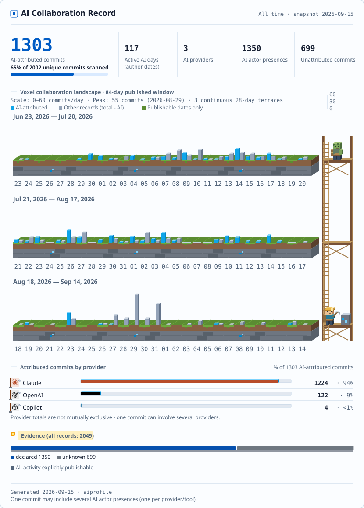

<!-- ============================================================
     WenyuChiou / WenyuChiou — profile README  ·  Style C (bold dashboard)
     Visual system: SVG header banner + shields for-the-badge section blocks.
     GitHub strips inline CSS, so all "design" is carried by images/badges.
     Edit content inside the tables / anchors; keep the badge headers as-is.
     ============================================================ -->

<b>English</b> · <a href="README.zh-TW.md">繁體中文</a>

  <a href="https://wenyuchiou.github.io/#decision-provenance">
    <picture>
      <source media="(prefers-color-scheme: dark) and (prefers-reduced-motion: reduce)" srcset="assets/research-loop-dark-static.svg?v=loop-1"/>
      <source media="(prefers-reduced-motion: reduce)" srcset="assets/research-loop-static.svg?v=loop-1"/>
      <source media="(prefers-color-scheme: dark)" srcset="assets/research-loop-dark.svg?v=loop-1"/>
      
    </picture>
  </a>

<!-- HIGHLIGHTS:START -->

  <strong>Open to Summer 2027 AI internships</strong> 
  Lehigh University · Bethlehem, PA · Ph.D. expected Dec 2027

<table width="100%">
<thead><tr>
  <th width="280" align="left" scope="col">Hiring &amp; resume</th>
  <th width="280" align="left" scope="col">Research &amp; work</th>
  <th width="280" align="left" scope="col">Contact &amp; social</th>
</tr></thead>
<tbody><tr>
  <td width="280" align="left" valign="top">
    
<a href="https://wenyuchiou.github.io/hire/" title="Recruiter brief"><picture><source media="(max-width: 1199px)" srcset="assets/profile-links/hire-en-compact.svg?v=columns-3"/><source media="(prefers-color-scheme: dark)" srcset="assets/profile-links/hire-en-dark.svg?v=columns-3"/></picture></a>

    
<a href="https://wenyuchiou.github.io/assets/Wenyu_Chiou_Industry_Resume_EN.pdf" title="Resume (English PDF)"><picture><source media="(max-width: 1199px)" srcset="assets/profile-links/resume-en-compact.svg?v=columns-3"/><source media="(prefers-color-scheme: dark)" srcset="assets/profile-links/resume-en-dark.svg?v=columns-3"/></picture></a>

  </td>
  <td width="280" align="left" valign="top">
    
<a href="https://wenyuchiou.github.io/" title="Portfolio"><picture><source media="(max-width: 1199px)" srcset="assets/profile-links/portfolio-en-compact.svg?v=columns-3"/><source media="(prefers-color-scheme: dark)" srcset="assets/profile-links/portfolio-en-dark.svg?v=columns-3"/></picture></a>

    
<a href="https://scholar.google.com/citations?user=vSQ3zT4AAAAJ&amp;hl=en" title="Google Scholar"><picture><source media="(max-width: 1199px)" srcset="assets/profile-links/scholar-en-compact.svg?v=columns-3"/><source media="(prefers-color-scheme: dark)" srcset="assets/profile-links/scholar-en-dark.svg?v=columns-3"/></picture></a>

  </td>
  <td width="280" align="left" valign="top">
    
<a href="mailto:wec324@lehigh.edu" title="Email Wenyu Chiou"><picture><source media="(max-width: 1199px)" srcset="assets/profile-links/email-en-compact.svg?v=columns-3"/><source media="(prefers-color-scheme: dark)" srcset="assets/profile-links/email-en-dark.svg?v=columns-3"/></picture></a>

    
<a href="https://www.linkedin.com/in/wenyu-chiou" title="LinkedIn"><picture><source media="(max-width: 1199px)" srcset="assets/profile-links/linkedin-en-compact.svg?v=columns-3"/><source media="(prefers-color-scheme: dark)" srcset="assets/profile-links/linkedin-en-dark.svg?v=columns-3"/></picture></a>

    
<a href="https://www.threads.com/@wenyu_chiou" title="Threads"><picture><source media="(max-width: 1199px)" srcset="assets/profile-links/threads-en-compact.svg?v=columns-3"/><source media="(prefers-color-scheme: dark)" srcset="assets/profile-links/threads-en-dark.svg?v=columns-3"/></picture></a>

  </td>
</tr></tbody>
</table>
<!-- HIGHLIGHTS:END -->

  <a href="https://wenyuchiou.github.io/WenyuChiou/dist/dashboard.html">
    <picture>
      <source media="(prefers-color-scheme: dark)" srcset="./dist/badge-dark.svg"/>
      
    </picture>
  </a> 

&nbsp;

Originally from Taiwan, now based in Bethlehem, Pennsylvania.

I’m a PhD researcher in Civil and Environmental Engineering at Lehigh University. My work sits at the intersection of behavioral science, LLM-based simulation, and quantitative evaluation. A central part of my research is understanding and modeling human decision-making. I evaluate whether LLMs capture meaningful decision processes, not only whether their answers sound plausible, but whether their perceptions and constraints relate coherently to the choices they make. I also work with agent-based modeling, which is widely used to simulate how individual decisions accumulate over time and interact with larger social, financial, and physical systems. My current direction is to move from traditional rule-based agents toward LLM-driven agents that can respond to richer information, memory, and changing conditions. More broadly, I’m interested in how human behavior can be simulated in a way that remains empirically grounded while interacting with and changing the external world.

&nbsp;

Verified by `ai-profile` · refreshed daily by GitHub Actions from public Git evidence · Unknown stays Unknown.

<a href="https://wenyuchiou.github.io/WenyuChiou/dist/dashboard.html">
  <picture>
    <source media="(prefers-color-scheme: dark)" srcset="./dist/summary-dark.svg"/>
    
  </picture>
</a>

  <strong><a href="https://wenyuchiou.github.io/WenyuChiou/dist/dashboard.html">Open interactive dashboard ↗</a></strong>

&nbsp;

| | |
|---|---|
| [**FLOODABM**](https://github.com/WenyuChiou/FLOODABM) | Agent-based model coupled with catastrophe flood modeling — household flood adaptation in the Passaic River Basin (NJ, 2011–2023) |
<!-- RESEARCH:START — add new research repos as table rows above this line -->
<!-- RESEARCH:END -->

`LLM Agents` · `AI Harness / Governed Agents` · `Agent-Based Modeling` · `Multi-Agent Systems` · `Catastrophe Modeling` · `Decision-Making Under Risk` · `Human-Environment Interaction`

&nbsp;

<!-- PUBS:START — newest first; format: - **[Title](link)** — venue, year -->
- [**Leveraging Large Language Models for Agent-Based Simulation of Human-Water System Interactions**](https://doi.org/10.1029/2025WR042111) — *Water Resources Research*, **62**(6), e2025WR042111 (2026)
<!-- PUBS:END -->

&nbsp;

| | |
|---|---|
| [**ai-research-skills**](https://github.com/WenyuChiou/ai-research-skills) | 5 plugins · 14 research skills · install in one command |
| [**agent-collab-skills**](https://github.com/WenyuChiou/agent-collab-skills) | Multi-agent orchestration — task splitter, output reconciler, debate, shared memory, acceptance gate |
| [**zotero-skills**](https://github.com/WenyuChiou/zotero-skills) | Programmatic Zotero CRUD — search, add, classify, annotate, organize literature |
| [**research-hub**](https://github.com/WenyuChiou/research-hub) | AI-operable research workspace for Zotero, Obsidian, and NotebookLM — CLI, MCP, REST, dashboard |
| [**academic-writing-skills**](https://github.com/WenyuChiou/academic-writing-skills) | Rigorous academic paper writing, revision, and submission — field-agnostic with per-paper journal overrides |
| [**codex-delegate**](https://github.com/WenyuChiou/codex-delegate) | Single-agent delegation skill used by the marketplaces above |
| [**ai-profile**](https://github.com/WenyuChiou/ai-profile) | Local-first AI collaboration analytics — explicit Git provenance in, privacy-safe cards and an interactive provider dashboard out |
<!-- TOOLING:START — add new tools as table rows above this line -->
<!-- TOOLING:END -->

Selected merged pull requests:

| | |
|---|---|
| [**ZhuLinsen/daily_stock_analysis**](https://github.com/ZhuLinsen/daily_stock_analysis) | Added Taiwan (台股) market support — market detection & routing, an institutional-flow (三大法人) data fetcher, and TWD currency / dividend fixes · [merged PRs](https://github.com/ZhuLinsen/daily_stock_analysis/pulls?q=is%3Apr+author%3AWenyuChiou+is%3Amerged) |
| [**langchain-ai/openwiki**](https://github.com/langchain-ai/openwiki) | Restricted `~/.openwiki` permissions on Windows, where `chmod` is a no-op · [#367](https://github.com/langchain-ai/openwiki/pull/367) |
| [**BuilderIO/agent-native**](https://github.com/BuilderIO/agent-native) | Routed `AGENT_ENGINE=codex-cli` to the Codex runner instead of crashing · [#1362](https://github.com/BuilderIO/agent-native/pull/1362) |
| [**Nanako0129/coralline**](https://github.com/Nanako0129/coralline) | Fixed auto-layout over-wrapping — measure display columns, not bytes · [#10](https://github.com/Nanako0129/coralline/pull/10) |
<!-- OSS:START — one row per MERGED PR (GitHub stamps the purple "Merged" badge); factual verbs only, no star counts -->
<!-- OSS:END -->

&nbsp;

| | |
|---|---|
| [**awesome-agentic-ai-zh**](https://github.com/WenyuChiou/awesome-agentic-ai-zh) |  7-stage agentic-AI roadmap · trilingual (繁中 canonical / 简中 / EN) · 240+ curated resources, from LLM basics to multi-agent production |

&nbsp;

  
  
  
  
  
  
  
  
  
  
  
  
  
  

&nbsp;

<!-- TROPHY:START — regenerated daily by .github/workflows/trophy.yml -->

<!-- TROPHY:END -->

&nbsp;

- **Lab** — [Complex Adaptive Water Systems (CAWS)](https://ethanyang28.wixsite.com/yceyang) · [Center for Catastrophe Modeling and Resilience](https://catmodeling.lehigh.edu/)

&nbsp;

Open to **full-time Summer 2027 internships** (approximately late May through mid-August) in LLM evaluation, agent systems, behavioral simulation, and AI for science. F-1 student; CPT eligible. Contact: [wec324@lehigh.edu](mailto:wec324@lehigh.edu)

  <!-- SNAKE:START — animation generated daily by .github/workflows/snake.yml (committed to the `output` branch) -->
  <picture>
    <source media="(prefers-color-scheme: dark)" srcset="https://raw.githubusercontent.com/WenyuChiou/WenyuChiou/output/github-snake-dark.svg" />
    <source media="(prefers-color-scheme: light)" srcset="https://raw.githubusercontent.com/WenyuChiou/WenyuChiou/output/github-snake.svg" />
    
  </picture>
  <!-- SNAKE:END -->

  <code>perceive → reason → verify → act · repeat</code>

