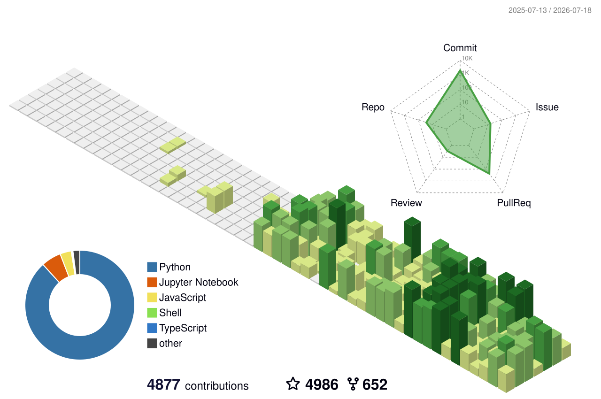

<!-- ============================================================
     WenyuChiou / WenyuChiou — profile README  ·  Style C (bold dashboard)
     Visual system: SVG header banner + shields for-the-badge section blocks.
     GitHub strips inline CSS, so all "design" is carried by images/badges.
     Edit content inside the tables / anchors; keep the badge headers as-is.
     ============================================================ -->

  

<!-- TAGLINE:START — animated; edit the lines= segments (separated by ;) -->

  

<!-- TAGLINE:END -->

  
  
  
  

<!-- HIGHLIGHTS:START — live, third-party-verified signals (auto-update) -->

  
  

<!-- HIGHLIGHTS:END -->

  
  
  
  

&nbsp;

I build **governed LLM-agent frameworks coupled with living environments**. My PhD integrates LLM-driven agents into flood-adaptation simulations grounded in real household data — each agent *perceives → reasons → is verified by a harness → acts*, talks to its neighbours, and co-evolves with a physically-based water system.

Broader AI interests: **quantifying decision-making with LLMs** · **agentic workflows** · **multi-agent collaboration** · **AI tooling for research**. I ship the infrastructure I use day-to-day as open-source Claude Code skills, MCPs, and plugins.

&nbsp;

| | |
|---|---|
| [**FLOODABM**](https://github.com/WenyuChiou/FLOODABM) | Agent-based model coupled with catastrophe flood modeling — household flood adaptation in the Passaic River Basin (NJ, 2011–2023) |
<!-- RESEARCH:START — add new research repos as table rows above this line -->
<!-- RESEARCH:END -->

`LLM Agents` · `AI Harness / Governed Agents` · `Agent-Based Modeling` · `Multi-Agent Systems` · `Catastrophe Modeling` · `Decision-Making Under Risk` · `Human-Environment Interaction`

&nbsp;

<!-- PUBS:START — newest first; format: - **[Title](link)** — venue, year -->
- **Leveraging Large Language Models for Agent-Based Simulation of Human-Water System Interactions** — *Water Resources Research*, **62**(6), e2025WR042111 (2026) · DOI [`10.1029/2025WR042111`](https://doi.org/10.1029/2025WR042111)
<!-- PUBS:END -->

&nbsp;

| | |
|---|---|
| [**ai-research-skills**](https://github.com/WenyuChiou/ai-research-skills) | 5 plugins · 14 research skills · install in one command |
| [**agent-collab-skills**](https://github.com/WenyuChiou/agent-collab-skills) | Multi-agent orchestration — task splitter, output reconciler, debate, shared memory, acceptance gate |
| [**zotero-skills**](https://github.com/WenyuChiou/zotero-skills) | Programmatic Zotero CRUD — search, add, classify, annotate, organize literature |
| [**research-hub**](https://github.com/WenyuChiou/research-hub) | AI-operable research workspace for Zotero, Obsidian, and NotebookLM — CLI, MCP, REST, dashboard |
| [**codex-delegate**](https://github.com/WenyuChiou/codex-delegate) · [**gemini-delegate-skill**](https://github.com/WenyuChiou/gemini-delegate-skill) | Single-agent delegation skills used by the marketplaces above |
<!-- TOOLING:START — add new tools as table rows above this line -->
<!-- TOOLING:END -->

&nbsp;

| | |
|---|---|
| [**awesome-agentic-ai-zh**](https://github.com/WenyuChiou/awesome-agentic-ai-zh) |  7-stage agentic-AI roadmap · trilingual (繁中 canonical / 简中 / EN) · 240+ curated resources, from LLM basics to multi-agent production |

&nbsp;

  
  
  
  
  
  
  
  
  
  
  
  
  
  

&nbsp;

<!-- THREEDEE:START — 3D isometric contribution graph, regenerated daily by .github/workflows/profile-3d.yml -->

<!-- THREEDEE:END -->

  

  

<!-- TROPHY:START — regenerated daily by .github/workflows/trophy.yml -->

<!-- TROPHY:END -->

&nbsp;

- **Personal site** (EN / 繁中) — [wenyuchiou.github.io](https://wenyuchiou.github.io/)
- **Lab** — [Complex Adaptive Water Systems (CAWS)](https://ethanyang28.wixsite.com/yceyang) · **Center** — [Catastrophe Modeling & Resilience](https://catmodeling.lehigh.edu/)
- **Contact** — wec324@lehigh.edu · [LinkedIn](https://www.linkedin.com/in/wenyu-chiou) · [ORCID](https://orcid.org/0009-0005-8006-1288)

  <!-- SNAKE:START — animation generated daily by .github/workflows/snake.yml (committed to the `output` branch) -->
  <picture>
    <source media="(prefers-color-scheme: dark)" srcset="https://raw.githubusercontent.com/WenyuChiou/WenyuChiou/output/github-snake-dark.svg" />
    <source media="(prefers-color-scheme: light)" srcset="https://raw.githubusercontent.com/WenyuChiou/WenyuChiou/output/github-snake.svg" />
    
  </picture>
  <!-- SNAKE:END -->

  <code>perceive → reason → verify → act · repeat</code>

