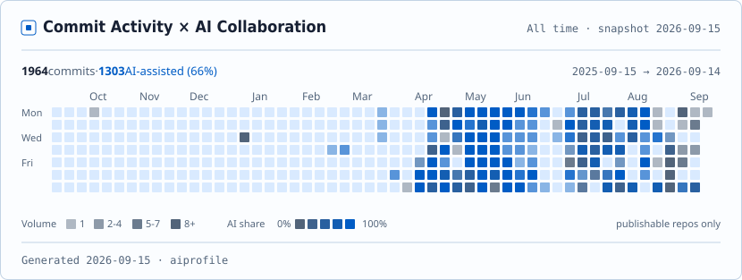

<!-- ============================================================
     WenyuChiou / WenyuChiou — 個人首頁 README（繁體中文版）
     英文版 landing page 見 README.md；此檔為語言切換連結進入的繁中鏡像。
     視覺系統與英文版一致：SVG banner + shields for-the-badge 區塊。
     Chinese badge 文字已 percent-encode（由 scripts 產生），請勿手改 URL。
     ============================================================ -->

<a href="README.md">English</a> · <b>繁體中文</b>

  

<!-- TAGLINE:START — 動畫標語；英文保留（JetBrains Mono 無中文字形，若換中文會變豆腐字） -->

  

<!-- TAGLINE:END -->

<!-- HIGHLIGHTS:START — 聯絡連結 + 即時星數 -->

  
  
  
  

<!-- HIGHLIGHTS:END -->

  
  
  
  

  <a href="https://github.com/WenyuChiou/ai-profile">
    <picture>
      <source media="(prefers-color-scheme: dark)" srcset="./dist/badge-dark.svg"/>
      
    </picture>
  </a>

&nbsp;

我打造**與真實環境耦合、受治理的 LLM 代理人框架**。我的博士研究把 LLM 驅動的代理人放進以真實家戶資料為基礎的洪水調適模擬——每個代理人*感知 → 推理 → 經 harness 驗證 → 行動*，會和鄰居互動，並與一個物理基礎的水文系統共同演化。

更廣的 AI 興趣：**用 LLM 量化決策行為** · **agentic workflow** · **多代理協作** · **研究用 AI 工具**。我把每天在用的基礎設施，以開源的 Claude Code skills、MCP 與 plugin 形式釋出。

&nbsp;

| | |
|---|---|
| [**FLOODABM**](https://github.com/WenyuChiou/FLOODABM) | 與災害洪水模型耦合、以代理人為基礎的（ABM）模型——Passaic 河流域（NJ，2011–2023）的家戶洪水調適 |
<!-- RESEARCH:START — 在此行上方新增研究 repo 表格列 -->
<!-- RESEARCH:END -->

`LLM Agents` · `AI Harness / Governed Agents` · `Agent-Based Modeling` · `Multi-Agent Systems` · `Catastrophe Modeling` · `Decision-Making Under Risk` · `Human-Environment Interaction`

&nbsp;

<!-- PUBS:START — 由新到舊；格式： - **[標題](連結)** — 期刊, 年份 -->
- **Leveraging Large Language Models for Agent-Based Simulation of Human-Water System Interactions** — *Water Resources Research*, **62**(6), e2025WR042111 (2026) · DOI [`10.1029/2025WR042111`](https://doi.org/10.1029/2025WR042111)
<!-- PUBS:END -->

&nbsp;

| | |
|---|---|
| [**ai-research-skills**](https://github.com/WenyuChiou/ai-research-skills) | 5 個 plugin · 14 個研究 skill · 一行指令安裝 |
| [**agent-collab-skills**](https://github.com/WenyuChiou/agent-collab-skills) | 多代理協作編排——任務拆分、輸出整合、辯論、共享記憶、驗收關卡 |
| [**zotero-skills**](https://github.com/WenyuChiou/zotero-skills) | 程式化操作 Zotero——搜尋、新增、分類、註解、整理文獻 |
| [**research-hub**](https://github.com/WenyuChiou/research-hub) | 可被 AI 操作的研究工作區，串接 Zotero、Obsidian、NotebookLM——CLI、MCP、REST、儀表板 |
| [**academic-writing-skills**](https://github.com/WenyuChiou/academic-writing-skills) | 嚴謹的學術論文撰寫、修訂與投稿——領域無關，依各論文／期刊覆寫規則 |
| [**codex-delegate**](https://github.com/WenyuChiou/codex-delegate) | 上述 marketplace 使用的單代理委派 skill |
<!-- TOOLING:START — 在此行上方新增工具表格列 -->
<!-- TOOLING:END -->

&nbsp;

以下是從選定 public repositories 取得、以明示 Git provenance 為依據的
AI 協作活動，由 [**ai-profile**](https://github.com/WenyuChiou/ai-profile)
在本機產生。Unknown commit 保持 unknown；若同一個 commit 包含多個 AI
actor，各 provider 的總數可能重疊。

<picture>
  <source media="(prefers-color-scheme: dark)" srcset="./dist/summary-dark.svg"/>
  
</picture>

 

<picture>
  <source media="(prefers-color-scheme: dark)" srcset="./dist/heatmap-dark.svg"/>
  
</picture>

&nbsp;

向我日常使用的開源專案送出、且已合併（merged）的 pull request：

| | |
|---|---|
| [**ZhuLinsen/daily_stock_analysis**](https://github.com/ZhuLinsen/daily_stock_analysis) | 新增台股支援——市場偵測與路由、三大法人資料抓取，以及 TWD 幣別／股利修正 · [已合併 PR](https://github.com/ZhuLinsen/daily_stock_analysis/pulls?q=is%3Apr+author%3AWenyuChiou+is%3Amerged) |
| [**langchain-ai/openwiki**](https://github.com/langchain-ai/openwiki) | 在 `chmod` 無作用的 Windows 上，收緊 `~/.openwiki` 的檔案權限 · [#367](https://github.com/langchain-ai/openwiki/pull/367) |
| [**BuilderIO/agent-native**](https://github.com/BuilderIO/agent-native) | 讓 CLI 在 `codex-cli` engine 下改走 Codex runner，而非直接崩潰 · [#1362](https://github.com/BuilderIO/agent-native/pull/1362) |
| [**Nanako0129/coralline**](https://github.com/Nanako0129/coralline) | 修正 auto-layout 過度換行——以顯示欄寬（而非位元組）計算 · [#10](https://github.com/Nanako0129/coralline/pull/10) |
<!-- OSS:START — 每列對應一個已合併（GitHub 顯示紫色 Merged 標記）的 PR；只用事實動詞，不放星數 -->
<!-- OSS:END -->

&nbsp;

| | |
|---|---|
| [**awesome-agentic-ai-zh**](https://github.com/WenyuChiou/awesome-agentic-ai-zh) |  7 階段 agentic-AI 學習地圖 · 三語（繁中為主 / 简中 / EN）· 240+ 精選資源，從 LLM 基礎到多代理 production |

&nbsp;

  
  
  
  
  
  
  
  
  
  
  
  
  
  

&nbsp;

<!-- THREEDEE:START — 3D 等距貢獻圖，每日由 .github/workflows/profile-3d.yml 重新產生 -->

<!-- THREEDEE:END -->

  

<!-- TROPHY:START — 每日由 .github/workflows/trophy.yml 重新產生 -->

<!-- TROPHY:END -->

&nbsp;

- **實驗室** — [Complex Adaptive Water Systems (CAWS)](https://ethanyang28.wixsite.com/yceyang) · [Center for Catastrophe Modeling and Resilience](https://catmodeling.lehigh.edu/)

&nbsp;

目前以**顧問**為主——**prompt review / audit** 與 **AI agent workflow 諮詢**。我是全職博士生、時間有限，但團隊或公司若在這些方向需要協助，歡迎來信：📧 [wenyuchiou12@gmail.com](mailto:wenyuchiou12@gmail.com)

  <!-- SNAKE:START — 每日由 .github/workflows/snake.yml 產生（提交到 output 分支） -->
  <picture>
    <source media="(prefers-color-scheme: dark)" srcset="https://raw.githubusercontent.com/WenyuChiou/WenyuChiou/output/github-snake-dark.svg" />
    <source media="(prefers-color-scheme: light)" srcset="https://raw.githubusercontent.com/WenyuChiou/WenyuChiou/output/github-snake.svg" />
    
  </picture>
  <!-- SNAKE:END -->

  <code>perceive → reason → verify → act · repeat</code>

